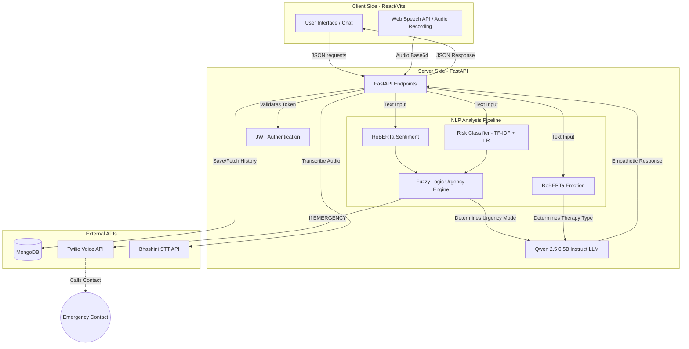

# Soul Connect - AI Mental Health Assistant

Soul Connect is an intelligent mental health assistant designed to provide emotional support, risk assessment, and crisis intervention through a conversational interface. It combines advanced NLP models with a robust React & FastAPI architecture to deliver a safe, responsive, and aesthetically pleasing user experience.

---

## 🚀 Setup & Installation (Local Development)

### 1. Backend

Wait for dependencies to install and configure your API keys.

```bash
cd backend
pip install -r requirements.txt
```

Create a `.env` file in the `backend` directory:
```env
JWT_SECRET="your-secret-key"
TWILIO_ACCOUNT_SID="your-account-sid"
TWILIO_AUTH_TOKEN="your-auth-token"
TWILIO_PHONE_NUMBER="your-twilio-number"
FRONTEND_URL="http://localhost:5173" # Update later for Vercel
```

### 2. Frontend

Install the Node modules and point Vite to your local backend.

```bash
cd frontend
npm install
```

Create a `.env.local` file in the `frontend` directory:
```env
VITE_API_URL="http://localhost:8000"
```

---

## ▶️ Running the Application

### 1. Start the Backend Server
```bash
cd backend
uvicorn api:app --reload --port 8000
```

### 2. Start the Frontend App
Open a new terminal window:
```bash
cd frontend
npm run dev
```

### 3. Exposing Local Backend for Vercel (Ngrok)
If you deploy the frontend to the internet (Vercel) while keeping the heavy AI backend running locally, you must run an Ngrok tunnel:
```bash
# In an active terminal window
npx ngrok http 8000
```
This gives you a public Forwarding URL (e.g., `https://untinned-houndy...ngrok-free.dev`). 
Set this as the `VITE_API_URL` environment variable inside your Vercel deployment settings. Then update the `.env` file in your `backend` so `FRONTEND_URL` allows your Vercel URL.

---

## 🏛️ System Architecture & Workflow

### Architecture Diagram



### Detailed Project Explanation

Soul Connect operates through a highly orchestrated pipeline designed to provide immediate, context-aware, and safe mental health support:

1. **User Interaction & Speech Processing**: The user communicates via the React frontend (typing or voice). Voice inputs are transcribed to text securely using the Bhashini Speech-to-Text API.
2. **Multi-Model NLP Analysis**: Every message hits the FastAPI backend and is simultaneously fed into three distinct models:
   - A RoBERTa model to classify basic **Sentiment** (Positive/Negative/Neutral).
   - A RoBERTa model to classify complex **Emotions** (Sadness, Anxiety, Fatigue, etc.).
   - A custom-trained TF-IDF Logistic Regression model to calculate the exact probability of **Self-Harm/Suicide Risk**.
3. **Fuzzy Logic Decision Engine**: To prevent false alarms, a `scikit-fuzzy` control system evaluates the risk probability against the sentiment score to output an exact **Urgency Score**. This determines the intervention mode: *Support* (casual), *Therapy* (structured CBT/Stress relief), or *Emergency* (crisis).
4. **Crisis Intervention (Twilio)**: If the fuzzy logic engine determines a high-risk *Emergency* state, a background task immediately triggers the Twilio API to place an automated voice call to the user's registered emergency contact, alerting them of the user's specific distressing message.
5. **Contextual LLM Generation**: The system dynamically generates a strict system prompt for the `Qwen/Qwen2.5-0.5B-Instruct` LLM. The prompt fuses the detected emotion, the urgency mode, and specific therapeutic techniques (e.g., CBT framing or grounding exercises) to generate a highly empathetic, safe, and de-escalating response.
6. **Data Persistence**: All chat sessions and user accounts are securely encrypted and stored in MongoDB Atlas, allowing seamless history retrieval and state management.

---

## ✨ Key Features

- **Engaging UI/UX**: Includes a welcoming entry page and a fully featured Landing page explaining the mission, features, and FAQs.
- **Conversational AI**: Human-like interactions that adapt to user sentiment and emotional states.
- **Text-to-Speech (TTS)**: Integrated Web Speech API to read bot messages aloud in a calming voice.
- **Crisis De-escalation Protocol**: If high risk is detected, the AI uses a strict dynamic system prompt to actively de-escalate the user while *silently* triggering Twilio to place an emergency call to a designated contact. The call explicitly recites the chat message that triggered the alarm.
- **User Authentication**: Secure JWT-based login and registration system.
- **Chat History**: Saves and retrieves conversation history with distinct chat session tracking.

---

## 🔐 Model Retraining

If you want to append new data to the Suicide Risk Classifier:
1. Add new text samples to `backend/Suicide_Detection.csv`.
2. Run `python clean_dataset.py` (if you added any custom noise removal scripts) or let testing strip out URLs and references.
3. Run `python train_risk_model.py`.
4. Overwrite confirmation will appear, saving the new `risk_model.pkl`. 

## License
